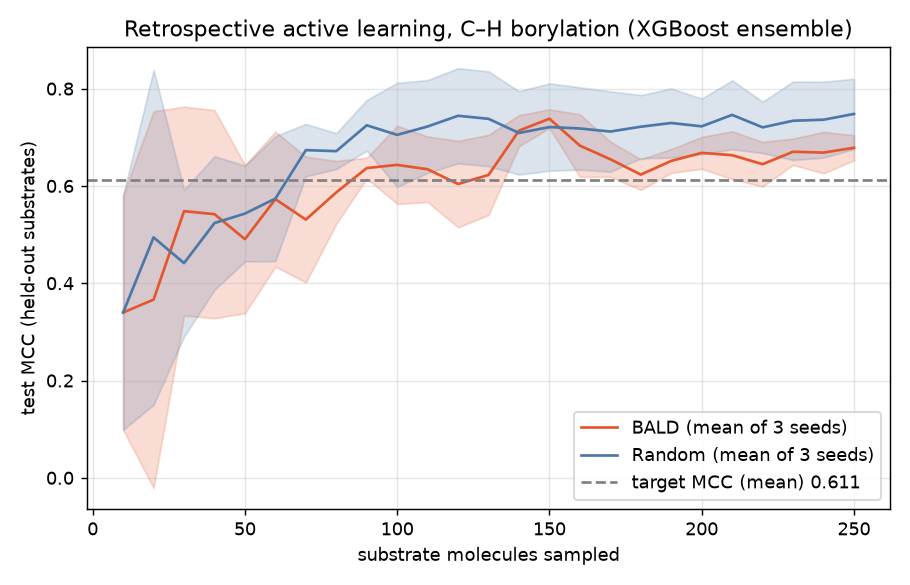
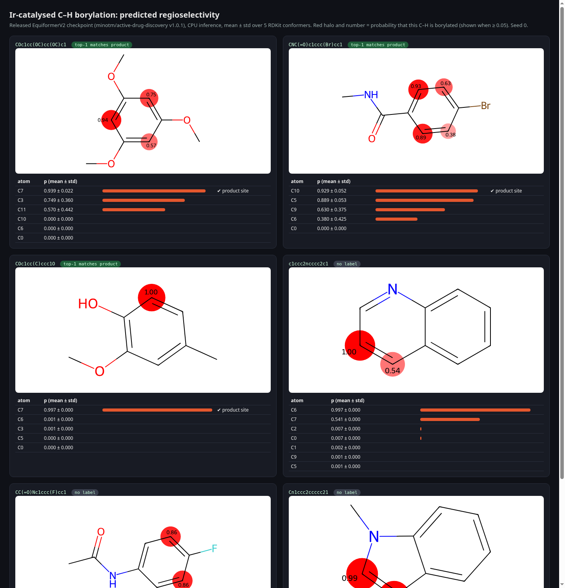

# active-borylation

Runnable CPU demo of **Minot et al., "Advancing chemical reaction prediction in data-scarce drug discovery with active and geometric deep learning"**, *Nature Computational Science* (published online 9 Oct 2026), ETH Zurich / Roche. [Paper](https://www.nature.com/articles/s43588-026-01063-0) · [code (GPL-3.0)](https://github.com/minotm/active-drug-discovery) · [data, CC-BY-4.0](https://doi.org/10.5281/zenodo.20773622)

> **Licence:** this folder is **GPL-3.0-or-later** (see `LICENSE`, `NOTICE`), separate from the rest of the repo, because it contains code derived from the upstream repository.

## Status (honest)
| Exp | What | Ran? | Result |
|---|---|---|---|
| 1 | Retrospective BALD vs random acquisition, XGBoost ensemble, 3 seeds | yes, CPU | **FAIL**: BALD needed 53.3 molecules on average to reach the target MCC, random needed 36.7. BALD was better on 0/3 seeds |
| 1x | Extremes: ensemble size and batch size | yes, CPU, seed 0 | see `experiments/exp1_bald_vs_random/breakpoints.md` |
| 2 | Released EquiformerV2 regioselectivity checkpoint on CPU, with a per-atom UI | yes, CPU | **PASS**: top-1 site correct on 3/3 molecules for every seed, at most 25 s per molecule. *Caveat:* all 3 labelled molecules are in the training set, so this only shows the checkpoint loads and runs |
| 3 | Retrain EquiformerV2 with and without auxiliary tasks on a scaffold split | **not run** | `exp3_colab.ipynb` and `config.yaml` are ready; this needs an approved GPU budget |

## Source verification (checked 10 Oct 2026)
- The paper URL resolves. Title matches, and it was published online 2026-10-09.
- The repo resolves at commit `c687cb1` and is GPL-3.0.
- **Zenodo 10.5281/zenodo.20783136 is the *software* archive** (`active-drug-discovery-v1.0.1.zip`, 669 kB, GPL-3.0), **not the weights**. The weights are GitHub release v1.0.1 assets (`equiformer_regio.pth`, 137,942,798 B; `ponita_binary.pth`; `binary_xgb.zip`), and the release notes give no separate licence for them.
- Zenodo 10.5281/zenodo.20773622 is the data, CC-BY-4.0, with five CSVs that are byte-identical in size to the copies in the upstream repo. The binary files hold 6,865 reactions (2044+2907+954+960) over **568** unique substrates. Regio_Data has 1,030 rows and **812** unique substrates; together the two sets cover 840 substrates.

## Run
```bash
./setup.sh      # venv, upstream clone at the pinned commit, EquiformerV2 weights (CPU torch)
./run_all.sh    # exp1 + exp2 -> results.csv/.md, plot.png, ui/predictions.js
(cd ui && python3 -m http.server 8765)   # open http://localhost:8765
```
CPU notes:
- `torch_scatter`, `torch_sparse` and `torch_cluster` have no wheels for current torch/py3.13, so `shims/` provides the minimal API the regio path needs. `pyg-lib` is required.
- Set `OMP_WAIT_POLICY=PASSIVE`. On a busy box, OpenMP spin-waiting made the XGBoost loop about 20× slower.

## Experiment 1: BALD vs random (`experiments/exp1_bald_vs_random/`)
- **Hypothesis:** BALD acquisition over substrates reaches the target test MCC with fewer substrate molecules than random.
- **Setup:** pool = all 6,865 reactions. A seed-specific 15% of substrates is held out for test. Features are ECFP4 (512 bits) plus one-hot conditions plus numeric columns. The model is a bootstrap ensemble of 10 XGBoost models. The run starts with 10 molecules and adds 10 per round up to 250. A substrate's score is the mean BALD across its reactions.
- **Target:** 0.9 × the full-pool MCC for that seed. **Pass:** BALD reaches the target with fewer molecules on at least 2 of 3 seeds and has the lower mean. Both were fixed before running.

| seed | full-pool MCC | target | BALD mols→target | random mols→target | BALD final MCC | random final MCC |
|---|---|---|---|---|---|---|
| 0 | 0.7064 | 0.6358 | 60 | 20 | 0.6929 | 0.6946 |
| 1 | 0.6964 | 0.6267 | 90 | 80 | 0.6938 | 0.8304 |
| 2 | 0.6346 | 0.5711 | 10 | 10 | 0.6486 | 0.7190 |

**FAIL.** This setup doesn't reproduce the paper's claimed advantage. Possible reasons, all untested: the simplified loop uses a substrate-mean BALD score, no hyperopt, and no condition enumeration, unlike upstream `active_learning.py`. Seed 2 also hit its target at initialisation. Plot: `experiments/exp1_bald_vs_random/plot.png`.



## Experiment 2: regioselectivity inference (`experiments/exp2_regio_inference/`)
`src/regio_json.py` runs the upstream `predict_regio.py` unchanged and exports per-atom p (mean ± std over 5 conformers) to `ui/predictions.js`. The table is in `results.md`.

| molecule | top-1 C (p) | product site | correct |
|---|---|---|---|
| COc1cc(OC)cc(OC)c1 | C7 (0.939) | C7 | yes |
| CNC(=O)c1ccc(Br)cc1 | C10 (0.929) | C10 | yes |
| COc1cc(C)ccc1O | C7 (0.997) | C7 | yes |
| quinoline | C6 (0.997) | no label | — |
| 4-fluoroacetanilide | C9 (0.862) | no label | — |
| N-methylindole | C2 (0.995) | no label | — |

Outputs were identical across seeds 0, 1 and 2, because upstream fixes the conformer seeds. Peak RSS was about 820 MB. Upstream bug found: `example_regio.csv` uses the column `PRODUCT_SMILES`, but the code reads `product_smiles`, so labels are silently ignored. Our copy renames the column.

 — video: `artifacts/regio-ui-scroll.mp4`

## Experiment 3: Colab stretch (not run)
`experiments/exp3_gnn_aux_scaffold/{config.yaml,exp3_colab.ipynb}` compares a Murcko-scaffold split (80/20, built in the notebook because upstream has no scaffold split) with and without `--coordinate_denoising --node_masking`, over 3 seeds. **Runtime estimate: not measured.** The notebook's timing cell runs 2 epochs per arm first. Budget = 6 runs × s/epoch × epochs before early stop; approve that before running the full loop.
